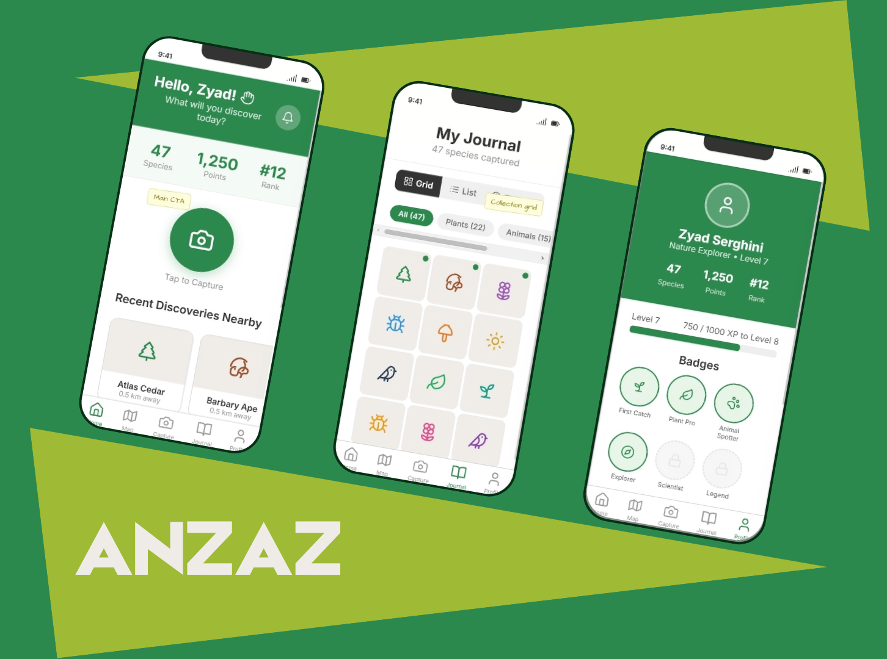

# ANZAZ — Biodiversity Demo App

<p align="center">
  
</p>

<video width="100%" autoplay muted loop playsinline>
  <source src="./assets/video_demo.mp4" type="video/mp4">
  Your browser does not support the video tag.
</video>

By [**Aya Alami**](https://github.com/ayaa14?), [**Nizar El Ghanbaz**](https://github.com/Zyssalone), [**Zyad Serghini**](https://github.com/ZyadSerghini)

## Table of Contents

1. [Project Overview](#project-overview)
2. [Technology Stack](#technology-stack)
3. [Architecture Layers](#architecture-layers)
4. [Data Flow & Lifecycle](#data-flow--lifecycle)
5. [Database Schema](#database-schema)
6. [Backend API](#backend-api)
7. [Frontend Structure](#frontend-structure)
8. [Authentication & Security](#authentication--security)
9. [Gamification System](#gamification-system)
10. [Deployment & Configuration](#deployment--configuration)

---

## Project Overview

**ANZAZ** is a mobile biodiversity tracking application that enables users to:

- Capture species sightings with GPS coordinates
- Explore global species distribution on an interactive map
- Maintain a personal journal of wildlife observations
- Compete on leaderboards and earn badges
- Complete challenges to gain XP and points
- Track their level progression and ranking

**Target Platform:** iOS & Android via React Native (Expo)  
**Architecture Type:** Full-stack with client-side demo mode (hardcoded mock data)

### Current State

The application exists in **dual mode**:

- **Frontend:** Fully functional with mock data (no backend required for testing)
- **Backend:** Express.js API + PostgreSQL (ready for deployment)
- **Integration:** Frontend can switch between mock data and live API via configuration

---

## Technology Stack

### Frontend

| Layer | Technology | Version | Purpose |
|-------|-----------|---------|---------|
| **Runtime** | React Native | 0.74 | Cross-platform mobile framework |
| **SDK** | Expo | 55.0.17 | Development & deployment tooling |
| **Language** | TypeScript | 5.3.0 | Type safety |
| **Navigation** | React Navigation | 6.x | Screen management (Stack + Bottom Tabs) |
| **Animations** | React Native Reanimated | 4.2.1 | Smooth transitions & micro-interactions |
| **UI Icons** | Lucide React Native | 0.447.0 | Consistent icon library |
| **Maps** | React Native Maps | 1.27.2 | Interactive map display |
| **Styling** | Theme System (custom) | — | Custom color, spacing, shadow tokens |

### Backend

| Layer | Technology | Version | Purpose |
|-------|-----------|---------|---------|
| **Runtime** | Node.js | 18+ | Server runtime |
| **Framework** | Express.js | 4.19.2 | HTTP API server |
| **Language** | JavaScript | ES6+ | Server-side logic |
| **Database** | PostgreSQL | 12+ | Relational data storage |
| **Driver** | pg | 8.12.0 | Node-PostgreSQL adapter |
| **Auth** | JWT + bcrypt | — | Token-based auth & password hashing |
| **Validation** | express-validator | 7.1.0 | Request validation |
| **CORS** | cors | 2.8.5 | Cross-origin resource sharing |

## Architecture Layers

### 3-Tier Architecture

```
┌─────────────────────────────────────────────────────────┐
│                    PRESENTATION LAYER                   │
│              (React Native + React Navigation)           │
│  - Screens: Auth, Home, Capture, Map, Journal, Profile  │
│  - Components: ProgressBar, StatusBadge, Cards, etc.    │
│  - Theme: Colors, Spacing, Shadows, Radius              │
└─────────────────────────────────────────────────────────┘
                          ↕ API Client
                  (fetch + custom request handler)
┌─────────────────────────────────────────────────────────┐
│                   APPLICATION LAYER                     │
│              (Express.js + Route Handlers)              │
│  - REST API endpoints (/api/auth, /species, etc.)       │
│  - Middleware: Auth validation, Error handling          │
│  - Business Logic: Sighting creation, XP rewards, etc.  │
└─────────────────────────────────────────────────────────┘
                          ↕ Database Driver
                      (pg connection pool)
┌─────────────────────────────────────────────────────────┐
│                     DATA LAYER                          │
│         (PostgreSQL with Relational Schema)             │
│  - Tables: users, species, sightings, challenges, etc.  │
│  - Relationships: Foreign keys, indexes, constraints    │
│  - PostGIS Support: Geographic queries (optional)       │
└─────────────────────────────────────────────────────────┘
```

### Frontend Directory Structure

```
frontend/
├── src/
│   ├── screens/              # Full-screen views
│   │   ├── SplashScreen      # Intro animation
│   │   ├── AuthScreen        # Login/Sign Up
│   │   ├── HomeScreen        # Dashboard + featured species
│   │   ├── CaptureScreen     # Camera modal + species selector
│   │   ├── ResultScreen      # Post-capture confirmation
│   │   ├── MapScreen         # Global sightings map
│   │   ├── JournalScreen     # User's sightings log
│   │   ├── ProfileScreen     # User stats, badges, leaderboard
│   │   └── SpeciesDetailScreen
│   │
│   ├── components/           # Reusable UI components
│   │   ├── ProgressBar       # XP/challenge progress
│   │   └── StatusBadge       # Species conservation status
│   │
│   ├── navigation/           # React Navigation setup
│   │   └── index.tsx         # Stack + Tab navigators
│   │
│   ├── utils/                # Helper functions
│   │   └── api.ts            # HTTP client + endpoint definitions
│   │
│   ├── data/                 # Mock data (demo mode)
│   │   └── mockData.ts       # Hardcoded species, challenges, users
│   │
│   ├── types/                # TypeScript definitions
│   │   └── navigation.ts     # Screen param types
│   │
│   └── theme/                # Design tokens
│       └── index.ts          # Colors, spacing, shadows, radius
│
├── App.tsx                   # Root component
├── app.json                  # Expo configuration
├── tsconfig.json            # TypeScript config
├── babel.config.js          # Babel setup
└── eas.json                 # Expo Application Services config
```

### Backend Directory Structure

```
backend/
├── src/
│   ├── index.js              # Express app initialization
│   │
│   ├── config/
│   │   └── db.js             # PostgreSQL connection pool
│   │
│   ├── routes/               # API endpoint handlers
│   │   ├── auth.js           # Register, login, me
│   │   ├── species.js        # GET species list/detail
│   │   ├── sightings.js      # Create/read sightings
│   │   ├── challenges.js     # User challenge progress
│   │   └── leaderboard.js    # Top 20 users by points
│   │
│   ├── middleware/
│   │   └── auth.js           # JWT verification
│   │
│   └── db/
│       ├── schema.sql        # Table definitions & constraints
│       ├── migrate.js        # Migration runner
│       └── seed.js           # Test data seeder
│
├── package.json
└── .env                      # Environment variables (git-ignored)
```

---

## Data Flow & Lifecycle

### User Registration Flow

```
┌─────────────────┐
│  AuthScreen     │ ← User enters: name, email, password
│                 │
└────────┬────────┘
         │ POST /auth/register
         │ { name, email, password }
         ↓
┌─────────────────────────────────────┐
│  Backend: POST /auth/register        │
│                                     │
│  1. Validate input (express-validator)
│  2. Check email uniqueness           │
│  3. Hash password (bcryptjs)         │
│  4. Create user row in DB            │
│  5. Sign JWT token                  │
└────────┬────────────────────────────┘
         │ { token, user }
         ↓
┌─────────────────────────────────────┐
│  Frontend: Store token               │
│  1. Save token in memory (_token)   │
│  2. Navigate to Main (tabs)         │
│  3. Fetch user profile (/auth/me)   │
└─────────────────────────────────────┘
```

### Species Sighting Capture Flow

```
┌────────────────────┐
│  CaptureScreen     │ ← User captures image + selects species
└────────┬───────────┘
         │ species_id selected
         ↓
┌────────────────────────────────────────┐
│  ResultScreen                          │
│  1. Display species details           │
│  2. User confirms + adds notes/location
└────────┬───────────────────────────────┘
         │ POST /api/sightings
         │ { species_id, latitude, longitude, ... }
         ↓
┌──────────────────────────────────────────────────┐
│  Backend: POST /api/sightings (auth middleware)  │
│                                                  │
│  1. Validate coordinates                        │
│  2. Create sighting row                         │
│  3. Award +50 XP, +50 points to user           │
│  4. Update user level                          │
│  5. Check challenge progress                   │
│  6. Return sighting data                       │
└──────────────────────────────────────────────────┘
         │ { sighting }
         ↓
┌─────────────────────────────────┐
│  Frontend: Update app state      │
│  1. Save to user's journal      │
│  2. Update profile stats        │
│  3. Navigate to Journal         │
└─────────────────────────────────┘
```

### API Request Lifecycle

```
Frontend (api.ts)
    ↓
setToken() → Bearer token stored in _token
    ↓
request() function:
    1. Build headers (Content-Type, Authorization)
    2. Construct URL from BASE_URL + path
    3. Call fetch(url, {method, headers, body})
    4. Parse response JSON
    5. If !ok → throw error
    6. Return typed data
    ↓
Screen/Component receives data → Update state → Re-render
```

---

## Database Schema

### Tables Overview

#### 1. **users**
Store authenticated users and their progression.

```sql
CREATE TABLE users (
  id              SERIAL PRIMARY KEY,
  name            VARCHAR(100) NOT NULL,
  email           VARCHAR(255) UNIQUE NOT NULL,
  password_hash   VARCHAR(255) NOT NULL,
  level           INTEGER DEFAULT 1,
  xp              INTEGER DEFAULT 0,      -- XP toward next level
  points          INTEGER DEFAULT 0,       -- Points for leaderboard
  created_at      TIMESTAMPTZ DEFAULT NOW()
);
```

**Relationships:** 1 user → many sightings, challenges, badges

**Index:** `email` (for login lookups)

---

#### 2. **species**
Biodiversity catalog with conservation information.

```sql
CREATE TABLE species (
  id                  SERIAL PRIMARY KEY,
  common_name         VARCHAR(150) NOT NULL,
  scientific_name     VARCHAR(200) NOT NULL,
  category            VARCHAR(50) NOT NULL,  -- plant, animal, insect, bird, fungi
  conservation_status VARCHAR(50) NOT NULL,  -- endangered, vulnerable, near-threatened, least-concern
  description         TEXT,
  habitat             TEXT,
  facts               JSONB DEFAULT '[]',    -- Array of {label, value} objects
  icon_color          VARCHAR(20) DEFAULT '#2d8a4e',
  created_at          TIMESTAMPTZ DEFAULT NOW()
);
```

**Constraints:** `category` and `conservation_status` are enums to ensure data integrity.

**Index:** None required (small table, queried by ID or category)

---

#### 3. **sightings**
Records of species captures by users with GPS data.

```sql
CREATE TABLE sightings (
  id            SERIAL PRIMARY KEY,
  user_id       INTEGER NOT NULL REFERENCES users(id) ON DELETE CASCADE,
  species_id    INTEGER NOT NULL REFERENCES species(id),
  latitude      DECIMAL(10,8),     -- GPS coordinate
  longitude     DECIMAL(11,8),     -- GPS coordinate
  location_name VARCHAR(200),      -- Human-readable location
  notes         TEXT,              -- User's observations
  created_at    TIMESTAMPTZ DEFAULT NOW()
);
```

**Indexes:**
- `idx_sightings_user` → Fast lookup by user
- `idx_sightings_species` → Fast lookup by species
- `idx_sightings_location` → Geographic queries (PostGIS ready)

**Cascade:** Deleting a user deletes all their sightings.

---

#### 4. **challenges**
Global challenges that all users can complete.

```sql
CREATE TABLE challenges (
  id              SERIAL PRIMARY KEY,
  title           VARCHAR(200) UNIQUE NOT NULL,
  description     TEXT,
  target          INTEGER NOT NULL,         -- e.g., "capture 10 species"
  category_filter VARCHAR(50),              -- NULL = all categories
  points_reward   INTEGER DEFAULT 100,
  active          BOOLEAN DEFAULT TRUE,
  created_at      TIMESTAMPTZ DEFAULT NOW()
);
```

**Examples:**
- "Capture 5 endangered species" → points_reward: 250
- "Find 10 birds" → category_filter: 'bird'

---

#### 5. **user_challenges**
Tracks individual progress on challenges.

```sql
CREATE TABLE user_challenges (
  id           SERIAL PRIMARY KEY,
  user_id      INTEGER NOT NULL REFERENCES users(id) ON DELETE CASCADE,
  challenge_id INTEGER NOT NULL REFERENCES challenges(id),
  progress     INTEGER DEFAULT 0,
  completed    BOOLEAN DEFAULT FALSE,
  completed_at TIMESTAMPTZ,
  created_at   TIMESTAMPTZ DEFAULT NOW(),
  UNIQUE(user_id, challenge_id)  -- One entry per user per challenge
);
```

**Flow:**
1. User creates a sighting of category X
2. Backend updates all `user_challenges` where `category_filter` matches X
3. If `progress >= target`, set `completed = TRUE` and `completed_at = NOW()`

---

#### 6. **badges**
Achievement definitions (global).

```sql
CREATE TABLE badges (
  id              SERIAL PRIMARY KEY,
  name            VARCHAR(100) UNIQUE NOT NULL,
  description     TEXT,
  icon_name       VARCHAR(50),                     -- Lucide icon name
  requirement_type VARCHAR(50),                    -- 'sighting_count', 'species_count', etc.
  requirement_value INTEGER,                       -- e.g., 50 sightings
  created_at      TIMESTAMPTZ DEFAULT NOW()
);
```

---

#### 7. **user_badges**
Badges earned by users.

```sql
CREATE TABLE user_badges (
  id       SERIAL PRIMARY KEY,
  user_id  INTEGER NOT NULL REFERENCES users(id) ON DELETE CASCADE,
  badge_id INTEGER NOT NULL REFERENCES badges(id),
  earned_at TIMESTAMPTZ DEFAULT NOW(),
  UNIQUE(user_id, badge_id)  -- Each user can earn each badge once
);
```

---

### Database Relationships

```
users (1) ─────────────── (N) sightings
  │                            │
  │                            └──────── (N) species
  │
  ├─────────────────────────── (N) user_challenges ─── (N) challenges
  │
  └─────────────────────────── (N) user_badges ─────── (N) badges
```

---

## Backend API

### Authentication

#### POST `/api/auth/register`

Register a new user.

**Request:**
```json
{
  "name": "John Doe",
  "email": "john@example.com",
  "password": "securePass123"
}
```

**Response (201):**
```json
{
  "token": "eyJhbGciOiJIUzI1NiIsInR5cCI6IkpXVCJ9...",
  "user": {
    "id": 1,
    "name": "John Doe",
    "email": "john@example.com",
    "level": 1,
    "xp": 0,
    "points": 0
  }
}
```

**Validations:**
- `name`: Required, trimmed
- `email`: Valid email format, unique
- `password`: Minimum 6 characters

---

#### POST `/api/auth/login`

Authenticate existing user.

**Request:**
```json
{
  "email": "john@example.com",
  "password": "securePass123"
}
```

**Response (200):**
```json
{
  "token": "eyJhbGciOiJIUzI1NiIsInR5cCI6IkpXVCJ9...",
  "user": { ... }
}
```

**Errors:**
- 401: Invalid credentials

---

#### GET `/api/auth/me`

Get current user profile (requires auth).

**Headers:**
```
Authorization: Bearer <token>
```

**Response (200):**
```json
{
  "id": 1,
  "name": "John Doe",
  "email": "john@example.com",
  "level": 5,
  "xp": 850,
  "points": 1200,
  "species_count": 23,
  "rank": 8
}
```

---

### Species Endpoints

#### GET `/api/species`

Retrieve all species with optional filters.

**Query Parameters:**
- `category` (optional): 'plant' | 'animal' | 'insect' | 'bird' | 'fungi'
- `status` (optional): 'endangered' | 'vulnerable' | 'near-threatened' | 'least-concern'

**Response (200):**
```json
[
  {
    "id": 1,
    "common_name": "Bengal Tiger",
    "scientific_name": "Panthera tigris tigris",
    "category": "animal",
    "conservation_status": "endangered",
    "description": "Large carnivorous feline...",
    "habitat": "Tropical forests",
    "facts": [
      { "label": "Weight", "value": "150-250 kg" },
      { "label": "Diet", "value": "Carnivore" }
    ],
    "icon_color": "#a0522d",
    "sightings": 127
  },
  ...
]
```

---

#### GET `/api/species/:id`

Get detailed information about a species.

**Response (200):**
```json
{
  "id": 1,
  "common_name": "Bengal Tiger",
  ...
  "sightings": 127  // Total global sightings of this species
}
```

---

### Sightings Endpoints

#### GET `/api/sightings`

Get all public sightings for map display.

**Response (200):**
```json
[
  {
    "id": 42,
    "latitude": 25.2761,
    "longitude": 88.6336,
    "location_name": "Sundarbans, Bangladesh",
    "created_at": "2026-04-15T10:30:00Z",
    "species_id": 1,
    "common_name": "Bengal Tiger",
    "icon_color": "#a0522d",
    "captured_by": "John Doe"
  },
  ...
]
```

**Limit:** Returns last 200 sightings (pagination recommended for scale)

---

#### GET `/api/sightings/my`

Get current user's sightings journal (protected).

**Headers:**
```
Authorization: Bearer <token>
```

**Response (200):**
```json
[
  {
    "id": 1,
    "latitude": 25.2761,
    "longitude": 88.6336,
    "location_name": "Local forest",
    "notes": "Spotted near old oak tree",
    "created_at": "2026-04-20T14:22:00Z",
    "species_id": 5,
    "common_name": "Monarch Butterfly",
    "facts": [...]
  },
  ...
]
```

---

#### POST `/api/sightings`

Create a new sighting (protected).

**Headers:**
```
Authorization: Bearer <token>
Content-Type: application/json
```

**Request:**
```json
{
  "species_id": 5,
  "latitude": 25.2761,
  "longitude": 88.6336,
  "location_name": "Local forest",
  "notes": "Spotted near old oak tree"
}
```

**Response (201):**
```json
{
  "id": 1,
  "user_id": 10,
  "species_id": 5,
  "latitude": 25.2761,
  "longitude": 88.6336,
  "location_name": "Local forest",
  "notes": "Spotted near old oak tree",
  "created_at": "2026-04-20T14:22:00Z"
}
```

**Side Effects:**
- User gains +50 XP
- User gains +50 points
- Level recalculated
- Challenge progress updated for matching category
- Badges checked for auto-unlock

**Validations:**
- `species_id`: Must be an integer
- `latitude`: -90 to 90
- `longitude`: -180 to 180

---

### Challenges Endpoint

#### GET `/api/challenges`

Get all active challenges with user's progress (protected).

**Headers:**
```
Authorization: Bearer <token>
```

**Response (200):**
```json
[
  {
    "id": 1,
    "title": "Bird Watcher",
    "description": "Capture 10 bird species",
    "target": 10,
    "category_filter": "bird",
    "points_reward": 250,
    "progress": 3,
    "completed": false,
    "completed_at": null
  },
  {
    "id": 2,
    "title": "Conservation Hero",
    "description": "Capture 5 endangered species",
    "target": 5,
    "category_filter": null,
    "points_reward": 500,
    "progress": 5,
    "completed": true,
    "completed_at": "2026-04-18T12:00:00Z"
  },
  ...
]
```

---

### Leaderboard Endpoint

#### GET `/api/leaderboard`

Get top 20 users ranked by points.

**Response (200):**
```json
[
  {
    "id": 5,
    "name": "Sarah Chen",
    "points": 5200,
    "level": 12,
    "species_count": 87,
    "rank": 1
  },
  {
    "id": 10,
    "name": "John Doe",
    "points": 3450,
    "level": 9,
    "species_count": 54,
    "rank": 4
  },
  ...
]
```

---

### Error Handling

All error responses follow this format:

```json
{
  "message": "Human-readable error message"
}
```

**Common Status Codes:**
- `200` — Success
- `201` — Created
- `400` — Bad request (validation error)
- `401` — Unauthorized (missing/invalid token)
- `404` — Not found
- `409` — Conflict (e.g., email already registered)
- `500` — Server error

---

## Frontend Structure

### Navigation Architecture

React Navigation uses **two main navigators**:

1. **Root Stack Navigator** (RootStackParamList)
   - `Splash` → Auto-transition to Auth after 2s
   - `Auth` → Login/Sign up screens
   - `Main` → Tabs navigator (authenticated state)
   - `Capture` → Modal overlay for species selection
   - `Result` → Sighting confirmation
   - `SpeciesDetail` → Deep view of species

2. **Bottom Tabs Navigator** (MainTabParamList)
   - `Home` → Dashboard, featured species, challenges
   - `Map` → Interactive map of sightings
   - `CaptureTab` → Special button (opens Capture modal)
   - `Journal` → User's sightings log (grid/list toggle)
   - `Profile` → User stats, badges, leaderboard

### Key Screens

#### **SplashScreen**
- Auto-advances to Auth after 2 seconds
- Brand animation (Leaf icon fade-in)

#### **AuthScreen**
- Toggle between "Log In" and "Sign Up" tabs
- Form fields: email, password (+ name for signup)
- Password visibility toggle
- Animated tab indicator + card transitions
- Currently: Auto-advances on any input (demo mode)

#### **HomeScreen**
- Greeting message + user stats header
- "Featured Species" carousel
- Recent sightings list
- Active challenges progress cards
- Category filter pills (plant, animal, insect, bird, fungi)
- Tap species card → SpeciesDetailScreen

#### **CaptureScreen**
- Modal overlay with species selector
- Search filter by category
- Species grid with color-coded icons
- Select species → ResultScreen

#### **ResultScreen**
- Display selected species info
- User can add location (manual entry or GPS)
- Add notes textarea
- Confirm button → POST /api/sightings
- Success animation + navigate to Journal

#### **MapScreen**
- React Native Maps integration
- Pins for all global sightings
- Tap pin → Species details
- Color-coded pins by conservation status
- (Optional) Cluster pins for dense areas

#### **JournalScreen**
- User's personal sightings log
- Toggle: Grid view vs. List view
- Each entry shows: species, location, date, notes
- Tap entry → SpeciesDetailScreen
- Pull-to-refresh to reload

#### **ProfileScreen**
- User card: name, level, XP bar, points
- Badge collection grid
- Leaderboard rank + position
- Tap badge → Achievement details
- Logout button

#### **SpeciesDetailScreen**
- Full species info card
- Header: common name + scientific name
- Conservation status badge
- Description + habitat + facts
- Global sightings map/count
- Related species suggestions
- "You've sighted this X times" indicator

### Theme System

Located in [src/theme/index.ts](src/theme/index.ts):

**Colors:**
- **Primary Green:** `#2d8a4e` (brand color)
- **Category-specific:**
  - Plant: `#2d8a4e`
  - Animal: `#a0522d`
  - Insect: `#3498db`
  - Bird: `#2c3e50`
  - Fungi: `#9b59b6`
- **Status indicators:** danger, warning, info

**Spacing System:**
```
xs: 4px
sm: 8px
md: 16px
lg: 24px
xl: 32px
xxl: 48px
```

**Border Radius:**
```
sm: 8px
md: 12px
lg: 16px
xl: 24px
full: 999px (pills)
```

**Shadows:**
- `sm`: Subtle (elevation 2)
- `md`: Medium (elevation 4)
- `lg`: Prominent (elevation 8)
- `primary`: Green-tinted shadow (CTA buttons)

### Component Library

**Reusable Components:**

- **ProgressBar** — XP/challenge progress visualization
- **StatusBadge** — Conservation status chip (endangered, vulnerable, etc.)
- **SpeciesCard** — Species display with image, name, category icon
- **ChallengeCard** — Challenge progress + reward info
- **BadgeIcon** — Earned achievement display

---

## Authentication & Security

### JWT Implementation

**Token Generation:**
```javascript
const token = jwt.sign(
  { id: userId },
  process.env.JWT_SECRET,
  { expiresIn: '30d' }
);
```

**Token Format:**
```
Header.Payload.Signature
```

**Payload:**
```json
{
  "id": 10,
  "iat": 1713619200,
  "exp": 1716297600
}
```

**Expiration:** 30 days (configurable via `JWT_EXPIRES_IN`)

### Password Security

**Hashing Algorithm:** bcryptjs (12 rounds)
```javascript
const hash = await bcrypt.hash(password, 12);
const match = await bcrypt.compare(password, hash);
```

**Why bcryptjs?**
- Adaptive cost factor (resistant to brute force)
- Automatic salt generation
- Industry standard

### Token Flow

1. **Registration/Login:**
   - Server generates JWT
   - Frontend stores in `_token` variable

2. **Authenticated Requests:**
   - Frontend adds `Authorization: Bearer <token>` header
   - Backend middleware validates token
   - If invalid/expired: return 401 Unauthorized

3. **Logout:**
   - Frontend clears `_token` (in-memory)
   - No server-side token revocation needed (stateless)
   - **Note:** For production, consider:
     - Token blacklist in Redis
     - Shorter expiration + refresh tokens

### Validation Middleware

**express-validator** checks:
- Email format
- Password length (min 6 chars)
- Input trimming & sanitization
- Type coercion (coordinates are floats)

---

## Gamification System

### XP & Levels

**XP Progression:**
- Each sighting: +50 XP
- Level up every 500 XP
- Level = `floor(total_xp / 500) + 1`

**Example:**
```
Total XP   Level
0-499      1
500-999    2
1000-1499  3
```

### Points & Leaderboard

**Points Awarded:**
- Sighting capture: +50 points
- Challenge completion: +points_reward (varies by challenge)

**Ranking:**
- Calculated as: `RANK() OVER (ORDER BY u.points DESC)`
- Top 20 shown in leaderboard

### Challenges

**Challenge Types:**
- **Species Count:** "Capture X species total"
- **Category Capture:** "Capture X birds"
- **Conservation Focus:** "Find X endangered species"

**Progress Update:**
When user creates a sighting:
1. Get species category
2. Find all active challenges where `category_filter` matches
3. Increment `progress` by 1
4. If `progress >= target`: set `completed = TRUE` + `completed_at = NOW()`
5. Award `points_reward` when completed

**Example Challenge:**
```sql
INSERT INTO challenges (title, target, category_filter, points_reward)
VALUES (
  'Bird Watcher',
  10,
  'bird',
  250
);
```
User must capture 10 bird species to complete.

### Badges

**Badge System:**
- Global achievements (stored in `badges` table)
- Earned when requirements met
- Can be automatically unlocked or awarded

**Example Badge:**
```sql
INSERT INTO badges (name, requirement_type, requirement_value)
VALUES (
  'Biodiversity Expert',
  'species_count',
  100
);
```
User earns badge after capturing 100+ unique species.

---

## Deployment & Configuration

### Environment Variables

**Backend (.env):**
```bash
# Database
DB_HOST=localhost
DB_PORT=5432
DB_NAME=anzaz
DB_USER=postgres
DB_PASSWORD=your_secure_password

# JWT
JWT_SECRET=your_super_secret_key
JWT_EXPIRES_IN=30d

# Server
PORT=3000
NODE_ENV=production
```

**Frontend (eas.json / app.json):**
```json
{
  "expo": {
    "name": "anzaz",
    "scheme": "anzaz",
    "plugins": [
      ["expo-location", { "locationAlwaysAndWhenInUsePermissions": "Allow" }]
    ]
  }
}
```

### Database Setup

**1. Create Database:**
```bash
createdb anzaz
```

**2. Create Tables:**
```bash
psql -d anzaz -f src/db/schema.sql
```

**3. Seed Test Data (optional):**
```bash
node src/db/seed.js
```

### Local Development

**Backend:**
```bash
cd backend
npm install
npm run dev  # Starts on port 3000
```

**Frontend:**
```bash
cd frontend
npm install
npm start    # Expo dev server
# Scan QR code with Expo Go
```

### Production Deployment

**Backend Options:**
- Heroku, Railway, Render (PaaS)
- AWS EC2, DigitalOcean (IaaS)
- Docker containerization recommended

**Frontend Options:**
- Expo Application Services (EAS) for managed builds
- Custom build pipeline with eas-cli
- App Store / Google Play distribution

### PostGIS Integration (Optional)

For geographic queries (e.g., "find species within 10km"):

```sql
CREATE EXTENSION postgis;

-- Add geometry column
ALTER TABLE sightings
ADD COLUMN location GEOMETRY(POINT, 4326);

-- Query: Species within radius
SELECT * FROM sightings
WHERE ST_DWithin(
  location,
  ST_GeomFromText('POINT(25.2761 88.6336)', 4326),
  10000  -- 10km in meters
);
```

---

## Summary: The Three Pillars

| Pillar | Technology | Role |
|--------|-----------|------|
| **Frontend** | React Native + Expo | Cross-platform mobile UI, navigation, animations |
| **Backend** | Express.js + Node.js | RESTful API, business logic, data validation |
| **Database** | PostgreSQL | Persistent data, relationships, constraints |

**Data Direction:**
```
User Input (Mobile) → Frontend API Client → Express Routes → PostgreSQL → Response → UI Update
```

**Security:**
- JWT tokens (stateless auth)
- Bcrypt password hashing
- Input validation (express-validator)
- CORS enabled for cross-origin requests

**Scalability Considerations:**
- Database indexes on frequently queried columns
- API pagination (recommended for sightings/leaderboard)
- Token-based auth allows stateless horizontal scaling
- CDN for static assets (Expo's built-in CDN)
- Optional caching layer (Redis) for leaderboard, active challenges

---

## Quick Reference: Key Files

| File | Purpose |
|------|---------|
| [backend/src/index.js](backend/src/index.js) | Express app setup + middleware |
| [backend/src/db/schema.sql](backend/src/db/schema.sql) | Database table definitions |
| [backend/src/middleware/auth.js](backend/src/middleware/auth.js) | JWT verification middleware |
| [frontend/App.tsx](frontend/App.tsx) | Root component + Navigation setup |
| [frontend/src/utils/api.ts](frontend/src/utils/api.ts) | HTTP client + endpoint definitions |
| [frontend/src/theme/index.ts](frontend/src/theme/index.ts) | Design tokens |
| [frontend/src/data/mockData.ts](frontend/src/data/mockData.ts) | Hardcoded demo data |
